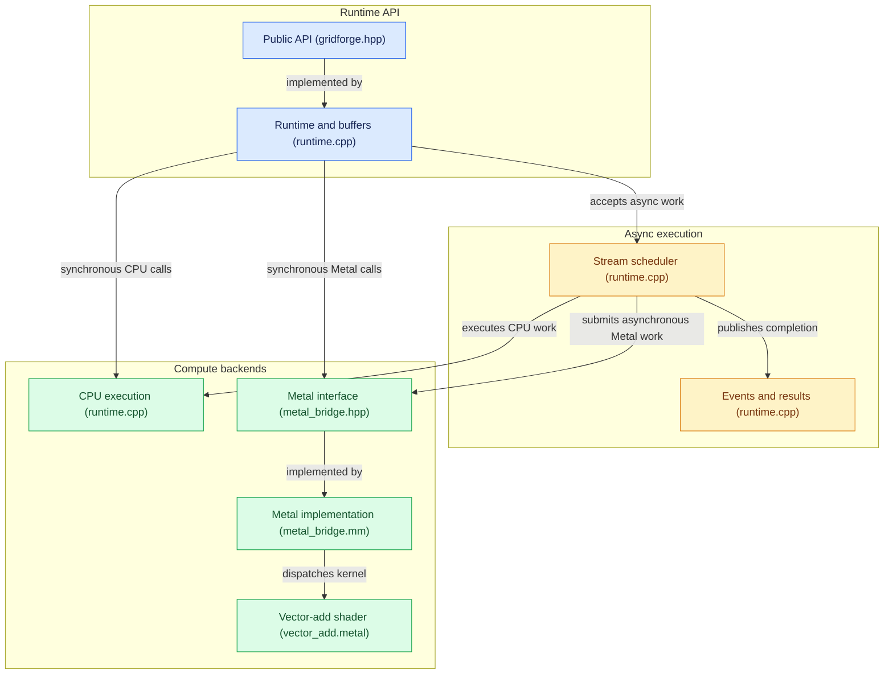

# GridForge

GridForge is a small C++20 compute runtime with a portable CPU backend and an optional Apple Metal backend. It provides RAII buffers, synchronous CPU/Metal vector addition, and asynchronous CPU/Metal streams and events. Backend selection remains explicit; unavailable Metal never falls back to CPU.

## Architecture

The public C++ API owns runtimes, buffers, streams, events, and download results. Synchronous calls dispatch directly to the selected backend. Accepted asynchronous work passes through the stream scheduler, which publishes completion after operation retirement.



The demos and benchmark runner use the same public API. CPU asynchronous work uses a bounded host worker pool. Metal asynchronous work submits command buffers and retires operations after completion callbacks; cross-stream dependencies are enforced by the host scheduler.

## Directory structure

| Path | Purpose |
| --- | --- |
| [README.md](README.md) | Project overview, API usage, build instructions, and validation. |
| [CMakeLists.txt](CMakeLists.txt) | Library, demos, benchmarks, test targets, and optional Metal configuration. |
| [LICENSE](LICENSE) | MIT license. |
| [include/gridforge/gridforge.hpp](include/gridforge/gridforge.hpp) | Public C++20 runtime, buffer, stream, event, result, and metrics API. |
| [src/runtime.cpp](src/runtime.cpp) | CPU backend, buffer ownership, async scheduler, dependencies, retirement, and operation metrics. |
| [src/metal_bridge.hpp](src/metal_bridge.hpp) | Private C++ interface to Metal. |
| [src/metal_bridge.mm](src/metal_bridge.mm) | Objective-C++ device, pipeline, command-buffer, and GPU-timing implementation. |
| [src/metal_shader.hpp.in](src/metal_shader.hpp.in) | Template used by CMake to embed the shader source. |
| [src/main.cpp](src/main.cpp) | Synchronous vector-add demo. |
| [src/async_main.cpp](src/async_main.cpp) | Independent asynchronous-stream demo. |
| [src/dependency_main.cpp](src/dependency_main.cpp) | Three-stream dependency pipeline demo. |
| [src/bench_main.cpp](src/bench_main.cpp) | Benchmark CLI, prepared cases, balanced measurement order, verification, and exports. |
| [src/bench_support.hpp](src/bench_support.hpp) | Statistics, partitioning, and measurement-order helpers. |
| [src/test_hooks.hpp](src/test_hooks.hpp) | Private deterministic completion hooks for scheduler tests. |
| [shaders/vector_add.metal](shaders/vector_add.metal) | Metal vector-add kernel with grid-tail bounds checking. |
| [tests/test_runtime.cpp](tests/test_runtime.cpp) | Synchronous runtime and buffer tests. |
| [tests/test_async.cpp](tests/test_async.cpp) | CPU async scheduling, ownership, limits, and failure tests. |
| [tests/test_async_metal.cpp](tests/test_async_metal.cpp) | Hardware-backed Metal async tests. |
| [tests/test_dependencies.cpp](tests/test_dependencies.cpp) | Dependency ordering, propagation, and retirement stress tests. |
| [tests/test_dependencies_metal.cpp](tests/test_dependencies_metal.cpp) | Hardware-backed Metal dependency tests. |
| [tests/test_bench.cpp](tests/test_bench.cpp) | CLI validation, statistics, sample counts, ordering, metrics, and export-failure regressions. |
| [scripts/validate_milestone5.sh](scripts/validate_milestone5.sh) | Release tests, repeated async/dependency tests, benchmark checks, and optional CPU sanitizer builds. |
| [scripts/check_benchmark_results.py](scripts/check_benchmark_results.py) | Independent standard-library checker for CSV, JSON, ordering, and operation records. |
| [docs/benchmark_methodology.md](docs/benchmark_methodology.md) | Timing boundaries, work definitions, export schemas, limits, and reproducibility. |
| [INSTALL_FIXES.md](INSTALL_FIXES.md), [ORDERING_FIX.md](ORDERING_FIX.md) | Historical installation and correction notes. |
| `.github/copilot-instructions.md` | Repository guidance for Copilot. |
| `.gitignore` | Exclusions for generated files and local artifacts. |

Build directories such as `build/` and `build-m5-fixed/`, benchmark exports in `bench_results/`, and validation logs/results in `validation_results/` are generated locally. Keep these paths ignored by Git. Alongside the existing build exclusions, include:

```gitignore
/bench_results/
/validation_results/
```

## Requirements and platform settings

- CMake 3.20 or newer and a C++20 compiler.
- Python 3 for the independent benchmark checker; Bash for the validation script.
- macOS builds enable Metal by default and compile for arm64 by default. The configured minimum deployment target is macOS 13.0; the Metal APIs used here are available at that level. Override `CMAKE_OSX_DEPLOYMENT_TARGET` or `CMAKE_OSX_ARCHITECTURES` at configure time when intentionally targeting a different Apple platform setup.
- Metal shader source is compiled at runtime through the system Metal framework. No separate `metal` command-line tool, downloaded package, CUDA, or external test framework is required.
- Non-macOS builds support CPU only. Setting `GRIDFORGE_ENABLE_METAL=ON` on an unsupported platform fails during CMake configuration.

## Configure, build, and test

From the repository root:

```sh
cmake -S . -B build -DCMAKE_BUILD_TYPE=Release
cmake --build build --parallel
ctest --test-dir build --output-on-failure --timeout 90
```

To build CPU only, including on macOS:

```sh
cmake -S . -B build-cpu -DCMAKE_BUILD_TYPE=Release -DGRIDFORGE_ENABLE_METAL=OFF
cmake --build build-cpu --parallel
ctest --test-dir build-cpu --output-on-failure --timeout 90
```

CTest runs synchronous CPU tests, synchronous Metal tests, CPU async scheduler/dependency tests, and separate hardware-backed async Metal and dependency tests. If Metal is not compiled in or no Metal device is available, all Metal tests report **Skipped** (not passed). Deterministic completion hooks cover pending submissions, dependency notification, retirement and failures without depending on GPU timing; the suites also cover ordering, results, ownership, limits, handoffs, access conflicts, stream isolation, and shutdown. Each test has a 90-second timeout.

Float comparisons use absolute tolerance $1\times10^{-5}$ plus relative tolerance $1\times10^{-5}\cdot|expected|$. CPU expectations are computed independently of the backend; a small fixed-value case also uses hand-specified expected results.

## Demonstration

Run CPU examples on any supported build. Metal commands require a Metal-enabled macOS build and an available device.

```sh
./build/gridforge_demo --backend cpu
./build/gridforge_demo --backend metal
./build/gridforge_async_demo --backend cpu
./build/gridforge_async_demo --backend metal
./build/gridforge_dependency_demo --backend cpu
./build/gridforge_dependency_demo --backend metal
```

The default demo uses 1,000,000 elements. Select another size with `--elements COUNT`. It reports the selected backend and device, element count, verification result, and **demonstration end-to-end wall-clock duration**. The measurement includes runtime setup, allocation, input generation, transfers, dispatch, and verification; it is not a performance claim or a GPU-only timing.

The async demo defaults to CPU and accepts `--backend cpu|metal`. It uses two streams with independent buffers, reports actual backend/device and configured host worker count, and verifies both downloads. Host worker count is not GPU thread count. The demo does not claim that operations execute concurrently or run faster.

The dependency demo uses three streams for `A + B`, then `C + B`, then download. It verifies against two sequential reference float additions, `(A + B) + B`, submits dependent work without first synchronizing producer/intermediate streams on the calling thread, and makes no overlap or speedup claim.

## Asynchronous CPU and Metal API

```cpp
gridforge::Runtime runtime; // CPU by default: four shared workers
auto stream = runtime.create_stream();
auto a = runtime.create_buffer(2 * sizeof(float));
auto b = runtime.create_buffer(2 * sizeof(float));
auto c = runtime.create_buffer(2 * sizeof(float));
const float input_a[] = {1.0F, -2.0F};
const float input_b[] = {3.0F,  4.0F};

stream.upload_async(a, std::as_bytes(std::span(input_a)));
stream.upload_async(b, std::as_bytes(std::span(input_b)));
stream.vector_add_async(a, b, c, 2);
auto result = stream.download_async(c);
auto event = stream.record_event();
event.wait();
auto output_bytes = result.get(); // valid while result remains alive
```

Cross-stream handoff uses a recorded event as an already-accepted dependency:

```cpp
auto produced = producer.record_event();
auto barrier = consumer.wait_event(produced); // enqueues a barrier; does not wait here
consumer.vector_add_async(c, b, d, count);
```

`Stream::upload_async()` copies source bytes into owned staging memory before returning; the input span may then be changed or destroyed. `Stream::download_async()` returns a move-only `DownloadResult` containing owned bytes. Its `get()` waits, rethrows execution failures, and returns a read-only span valid while the result handle remains alive. `Event::is_complete()` and `DownloadResult::is_ready()` are nonblocking observations; `wait()` waits and rethrows a recorded asynchronous failure, while `Event::rethrow_if_failed()` checks only an already-completed event.

Operations are accepted under the scheduler lock, which defines their order. A stream executes accepted work in that order, with at most one active operation at a time. An event marks its exact position and later submissions do not extend it. `wait_event()` accepts only an event already returned by `record_event()` from the same runtime; it enqueues a consumer barrier and returns a completion event without waiting for the producer. A dependency-blocked stream is parked outside the worker-ready queue and awakened by event retirement. Already-completed dependencies are handled during registration, and multiple consumers may subscribe to one event.

Dependency edges refer only to previously accepted event positions. Combined with stream FIFO order, this makes cycles impossible with the supported API; waiting on the same stream's earlier event is valid. Events retain immutable prefix coverage: their stream prefix plus transitive prefixes inherited through earlier barriers. Buffer reservations carry exact stream positions. A conflicting access may be accepted only if preceding dependency barriers cover that reservation; writes later than an event prefix and unrelated conflicts remain rejected. Read/read sharing remains allowed. Coverage is compacted to one high-water prefix per contributing stream, not an operation history, and subscriptions are removed at retirement.

CPU work uses the shared bounded host pool. Metal dependencies are host-mediated: dependent Metal work is encoded/committed only after its barrier retires. Completion notification, buffer effects, reservation/accounting retirement, and event publication remain ordered; neither worker threads nor callbacks wait on dependency events.

`Stream::synchronize()` and `Runtime::synchronize()` snapshot the accepted positions while holding the scheduler lock, then wait only for that snapshot. Submissions accepted later by another thread are not included. Use external coordination if a call must include concurrent producers' later submissions. `RuntimeOptions::worker_count` configures host encoding/transfer workers on either backend; it does not configure GPU threads or indicate GPU parallelism.

## Async ownership, safety, and limits

- Every accepted operation retains the underlying buffers, so moving or destroying public `Buffer` handles does not invalidate queued work. Destroying a `Stream` handle does not cancel accepted work. Runtime destruction stops acceptance, drains all accepted operations, closes remaining streams, and joins workers. Destructors do not throw; events and owned download results remain inspectable afterward.
- Access is reserved at acceptance and held through retirement. Ordered reuse within one stream is allowed. A conflicting pending access from another stream or synchronous API is rejected unless dependency prefixes prove it ordered; simultaneous read-only reservations are allowed. The runtime does not retain locks across kernels, copies, Metal calls, or waits.
- Upload bytes are charged against runtime staging until the upload retires. Download output bytes are charged from submission through result-handle lifetime, including after completion; the bytes are released when the last result owner is destroyed. Failed/rejected operations release their reservations, operation slots, and staging budget.
- The defaults are four host workers on either backend, 1,024 outstanding operations (queued and running, per runtime), and 64 MiB of runtime-owned upload staging plus download results. These limits can be set through `RuntimeOptions`. Host workers execute CPU operations or encode/copy Metal work; they are not GPU threads. Submissions never block for capacity: exceeding a limit throws `std::length_error` synchronously.
- An execution or dependency exception fails the affected event/barrier and consumer stream, skips later accepted work there, and rejects future submissions on that stream. A failed producer event is propagated to consumers without changing unrelated streams. Other streams continue when the device remains usable. Event waits, result retrieval, and synchronization propagate failures.
- `Runtime::create_stream()` is supported for both available backends. Future placeholders, resettable events, and cross-runtime event waits are not supported.

## Runtime contract

- A buffer owns exactly the byte count requested at creation. Zero-byte buffers are valid; nonzero transfers must fit fully within the buffer. Upload and download are explicit host-memory copies.
- `vector_add` requires three distinct buffers owned by the dispatching runtime. Each must be exactly `element_count * sizeof(float)` bytes; size multiplication is checked for overflow. `A` and `B` are read, and `C` is written. Zero elements require three zero-byte buffers and perform no dispatch.
- The default combined buffer-allocation limit per runtime is 512 MiB. All three vector-add buffers count toward it, and released buffers return their allocation budget.
- Metal uses shared-storage buffers. Threadgroup width is derived from pipeline limits; the kernel guards the grid tail. Synchronous Metal launches wait before returning. Async Metal dispatch commits without waiting on its host worker; downloads execute after same-stream GPU completion and copy into owned result storage before retirement publishes readiness.
- Metal device discovery, shader compilation, pipeline creation, command submission, and completion errors are reported to the caller.

## Implementation languages

- Public API, CPU backend, demo, and tests: ordinary C++20.
- Private framework bridge and Metal device/pipeline/command handling: Objective-C++ (`.mm`), linking the system Metal and Foundation frameworks. Objective-C types do not appear in the public API.
- GPU kernel: Metal Shading Language in `shaders/vector_add.metal`, embedded for runtime compilation by CMake without requiring the standalone Metal compiler tool.

## Project boundaries

GridForge does not support CUDA source, CUDA binary compatibility, PTX, NVIDIA libraries, filtering kernels, a CUDA backend, native Metal shared-event dependencies, ahead-of-time dependent command submission, or automatic backend selection.

## Benchmarking and measurement methodology

The benchmark executable is `gridforge_bench` and is intended for Release builds, not sanitizer or debugger runs. It records timing with `std::chrono::steady_clock` and writes raw CSV plus summary JSON to the output directory.

```sh
cmake -S . -B build -DCMAKE_BUILD_TYPE=Release
cmake --build build --parallel
./build/gridforge_bench --backend cpu --workload all --mode both --output-dir build/bench_cpu
./build/gridforge_bench --backend metal --workload all --mode both --output-dir build/bench_metal
./build/gridforge_bench --backend both --workload streams --mode both --streams 1,2,4 --output-dir build/bench_both
```

`--mode` accepts `sync`, `async`, or `both` (the default). Inputs, expected values, buffers, and streams are prepared once per case; runtime initialization and buffer allocation are reported separately. Warmups and measured iterations reuse the case resources. Measured case order rotates deterministically between rounds. With both backends available, matching cases run next to each other and the first backend alternates for each logical case across rounds. The default 20-iteration run measures each matched case CPU first 10 times and Metal first 10 times.

`results.csv` contains one row per verified measured iteration, including case/iteration/order IDs, actual stream/launch/element-addition counts, and only applicable timing values. `summary.json` contains per-case count, minimum, median, mean, sample standard deviation, maximum, and nearest-rank p95 statistics, timing boundaries, backend/device, partitions, runtime limits, seed, host/compiler/build metadata, and Git revision/dirty state when obtainable. End-to-end timing includes transfers/submissions through completed downloads; async submission timing ends when the final async API call returns; resident compute excludes input upload and output download. Verification and result-handle release occur outside measured timing, before the next iteration. Failed cases are reported in the summary and cause a nonzero exit; failed iterations are excluded from raw verified samples and statistics.

Instrumentation is disabled by default. `--detailed` enables bounded runtime records for accepted async stream operations (including event operations). Capacity defaults to 4,096; `--metric-capacity N` adjusts it. After each case preparation, warmup, and measurement, the runner drains metrics and streams them to `operations.jsonl` with case, phase, iteration, and measurement-order IDs. Synchronous calls and rejected-before-acceptance submissions emit no operation records. Missing stages are JSON `null`; Metal GPU timestamps are separate from the host clock and their differences are command-buffer durations. Per-case drops and `instrumentation.complete` make overflow explicit. Detailed runs include instrumentation overhead.

The summary schema is now `gridforge.benchmark.v2`; operation records are in the referenced JSONL file instead of an embedded array. Before case allocation, the runner checks the whole retained buffer matrix against each runtime's 512 MiB budget and prepared inputs/expected answers against a combined 1 GiB host budget. See [benchmark_methodology.md](docs/benchmark_methodology.md) for schemas and bounds.

Run an ordinary baseline and independently check its exports:

```sh
./build/gridforge_bench --backend both --workload all --mode both \
  --output-dir bench_results/m5-balanced
python3 scripts/check_benchmark_results.py bench_results/m5-balanced
```

With both backends available, default settings produce 120 cases and 2,400 verified measured samples. For operation lifecycle diagnostics, use a separate detailed run:

```sh
./build/gridforge_bench --backend both --workload all --mode both \
  --sizes 256,257 --streams 1,2 --warmup 1 --iterations 2 \
  --detailed --output-dir bench_results/m5-detailed
python3 scripts/check_benchmark_results.py bench_results/m5-detailed
```

Ordinary runs write `results.csv` and `summary.json` and intentionally report zero attributed operations. Detailed runs also write `operations.jsonl`; only accepted asynchronous operations contribute records.

Size and stream lists reject empty fields, malformed or overflowing integers, and zero values. For example, `--sizes '256,'` is invalid. A requested case failure causes a nonzero exit even if other cases succeed; output open/write/flush failures also cause a nonzero exit.

## Validation

Run the quick validation or the full validation from the repository root:

```sh
bash scripts/validate_milestone5.sh --quick
# Full default matrix plus separate CPU ASan/UBSan and TSan builds:
bash scripts/validate_milestone5.sh
```

The script writes timestamped logs and exports under `validation_results/`. On macOS it enables Metal and requests both backends; elsewhere it uses CPU. CPU sanitizer builds deliberately disable Metal, so the three Metal tests are expected to report **Skipped** in those builds.

### Results

Validation recorded on October 9, 2026, using an Apple M5 Pro, macOS arm64, and Clang 21:

| Check | Result |
| --- | --- |
| Release CPU/Metal CTest suite | 7/7 passed. |
| Async and dependency suites | Each CPU/Metal suite passed 30 consecutive repetitions. |
| Corrected ordinary smoke matrix | 72 verified cases, 216 measured samples; export checker passed. |
| Corrected detailed smoke matrix | 40 verified cases, 80 measured samples, 324 attributed operations, zero drops; export checker passed. |
| CPU AddressSanitizer/UndefinedBehaviorSanitizer build | Four CPU/benchmark tests passed; three Metal tests skipped. |
| CPU ThreadSanitizer build | Four CPU/benchmark tests passed; three Metal tests skipped. |
| Full balanced baseline | 120 verified cases, 2,400 measured samples; export checker passed. |

The export checks verify raw-sample statistics, applicable timing fields, fixed work counts, balanced backend ordering, and operation attribution/drop counts for detailed runs. Completion covers the implemented runtime and measurement infrastructure. The results above establish correctness and export consistency; they do not establish a universal CPU/Metal speedup.

The benchmark does not compare CPU end-to-end times with Metal GPU-only timings as a speedup, and it never treats host worker count as GPU thread count. Raw upload/download bytes are host copies, not PCIe-transfer or GPU-memory bandwidth measurements.

The default benchmark sizes are 256, 4,096, 65,536, 262,144, and 1,000,000 elements with stream counts 1, 2, and 4. Warmup iterations default to 5 and measured iterations to 20. A fixed seed is used by default and results are written to `results.csv` and `summary.json` under the chosen output directory. The runner exports no username, serial number, credentials, or device UUID.

## License

GridForge is licensed under the [MIT License](LICENSE).
